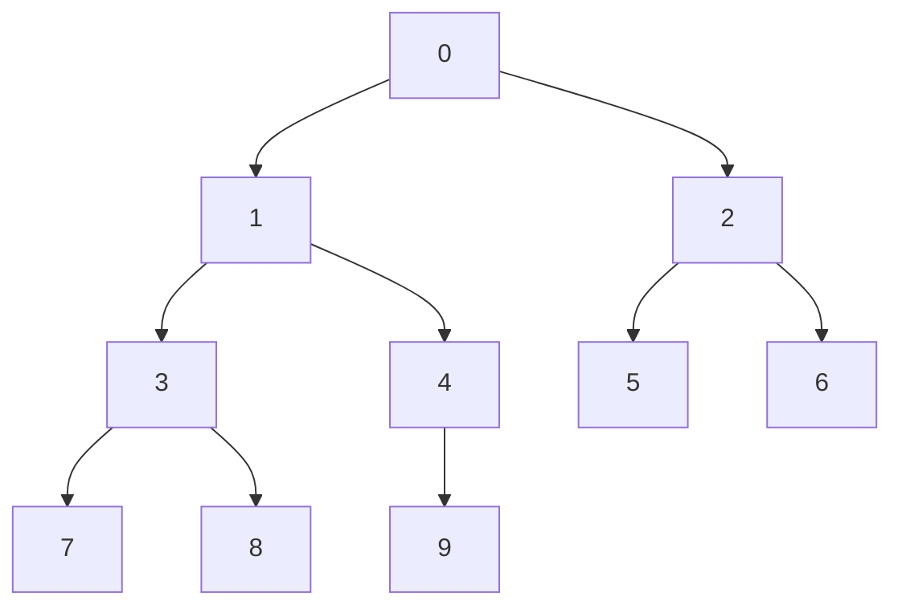

# Heap
Куча представлена как массив, но надо держать в голове картинку в виде дерева, где у каждого узла 2 ребенка и значение каждого узла не больше значения двух
его детей (простое следствие, минимальный по куче лежит в нулевом узле).
Например, массив [0,1,2,3,4,5,6,7,8,9] есть куча

