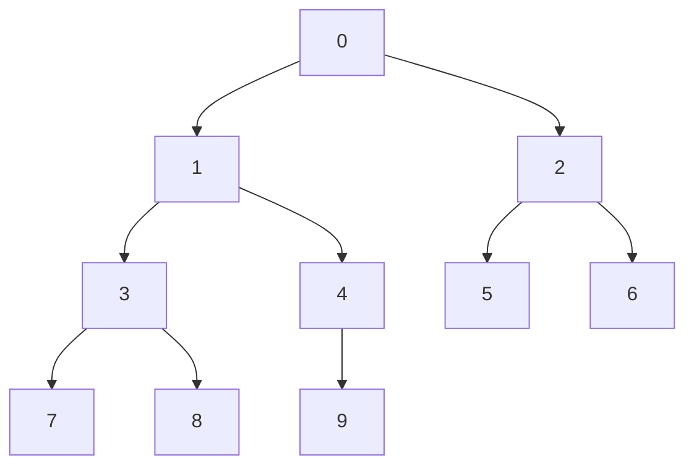
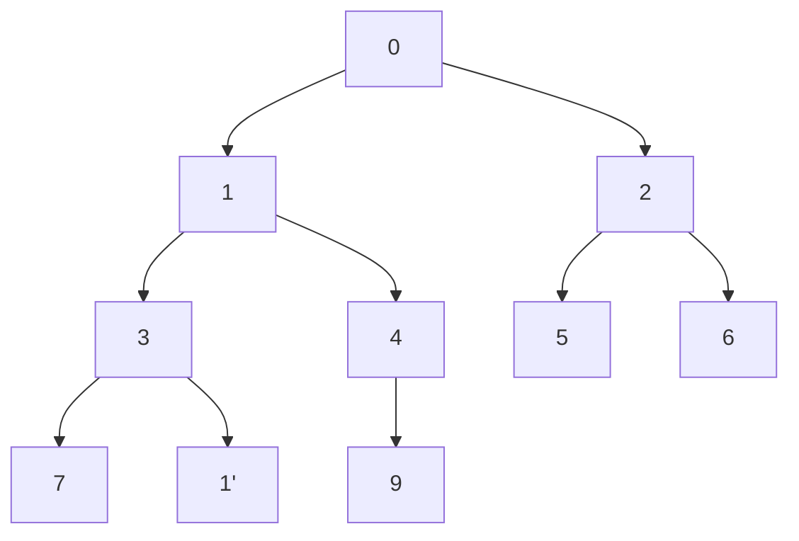

# Heap
Куча представлена как массив, но надо держать в голове картинку в виде дерева, где у каждого узла 2 ребенка и значение каждого узла не больше значения двух
его детей.
Например, массив [0,1,2,3,4,5,6,7,8,9] есть куча

Простое следствие: минимальный по куче лежит в нулевом узле.
Таким образом, функция GetMin() возвращает нулевой элемент.

Функция SiftUp() просеивает элемент вверх, то есть если элемент по значению меньше своего родителя, то меняет их местами и запускает SiftUp для новой позиции.
Например такая куча

перейдет в такую

